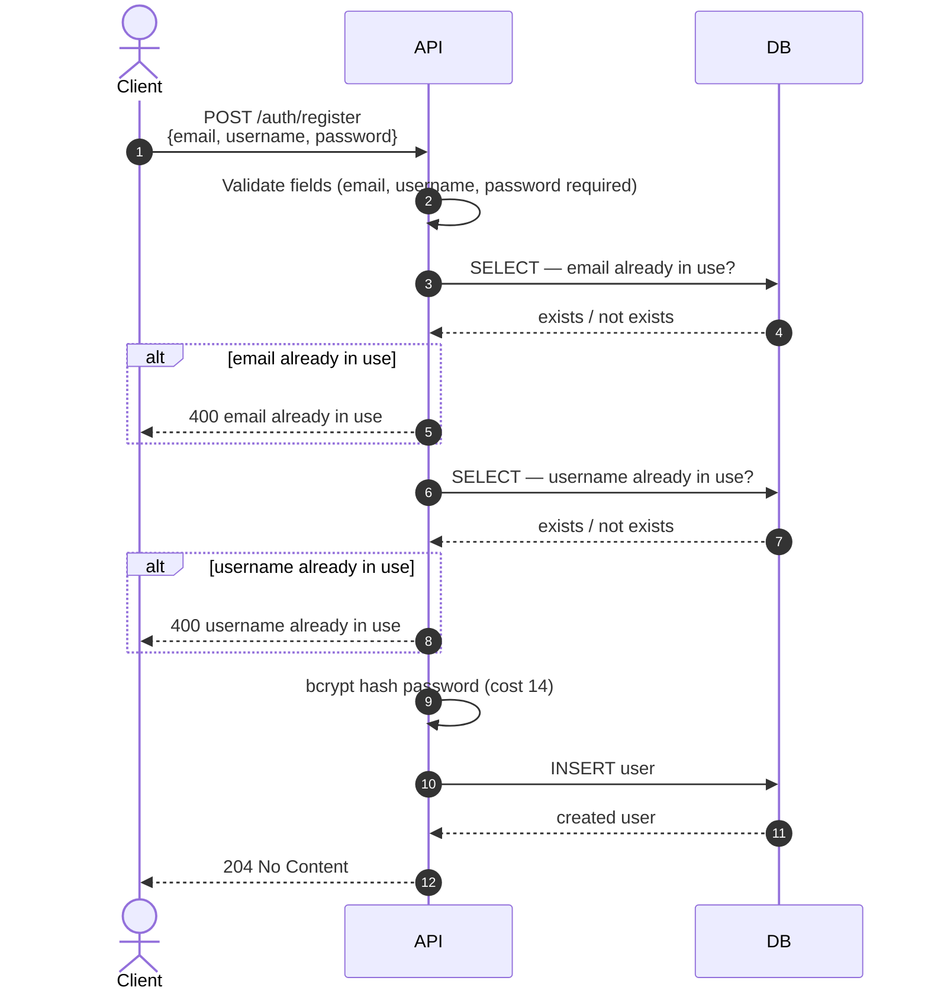
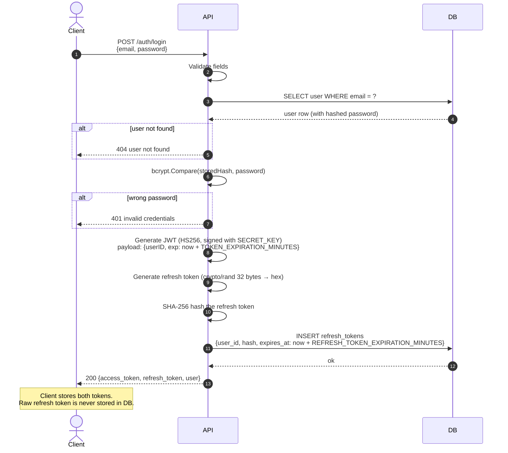
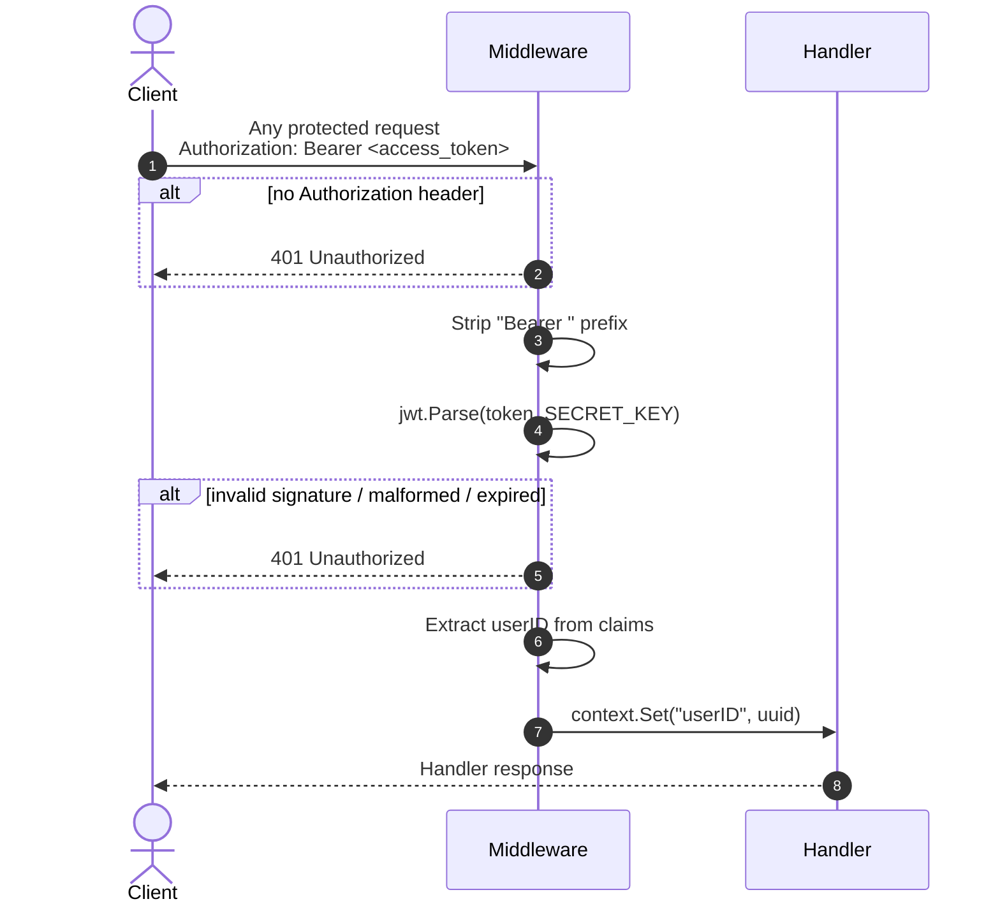
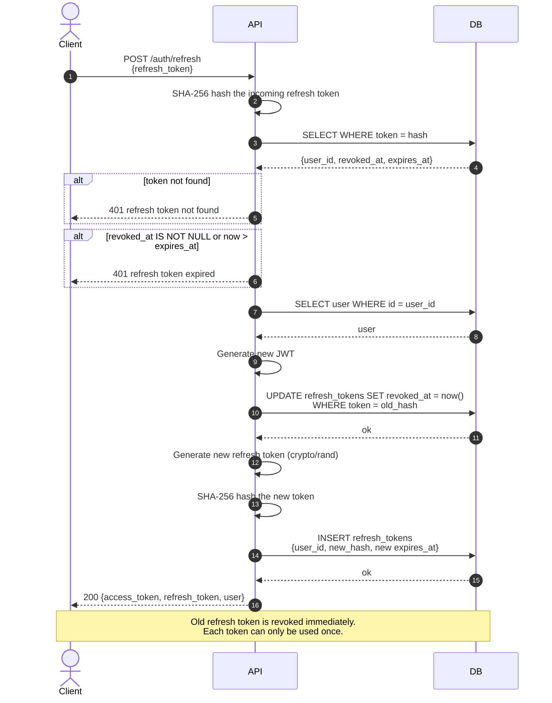
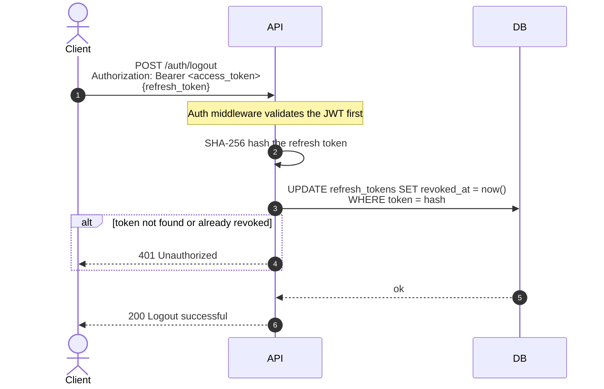
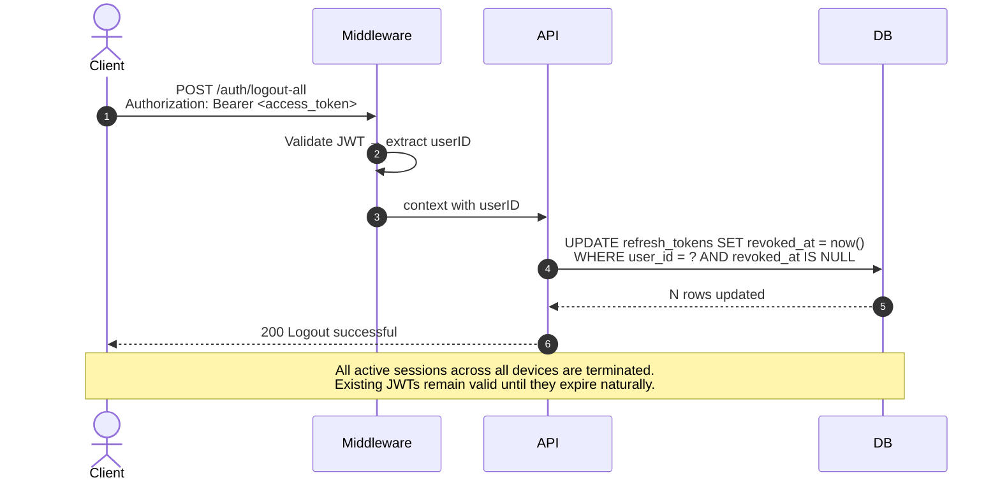
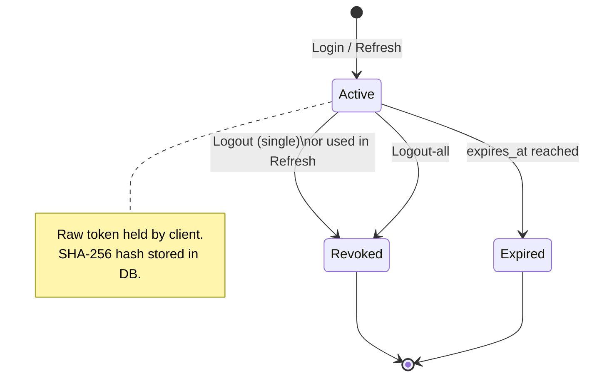

# Authentication Flow

This document describes every authentication flow in the API using sequence diagrams.

---

## 1. Register

---

## 2. Login

---

## 3. Authenticated Request (Middleware)

---

## 4. Token Refresh (Rotation)

---

## 5. Logout (Single Session)

---

## 6. Logout All (All Sessions)

---

## Token Lifecycle

